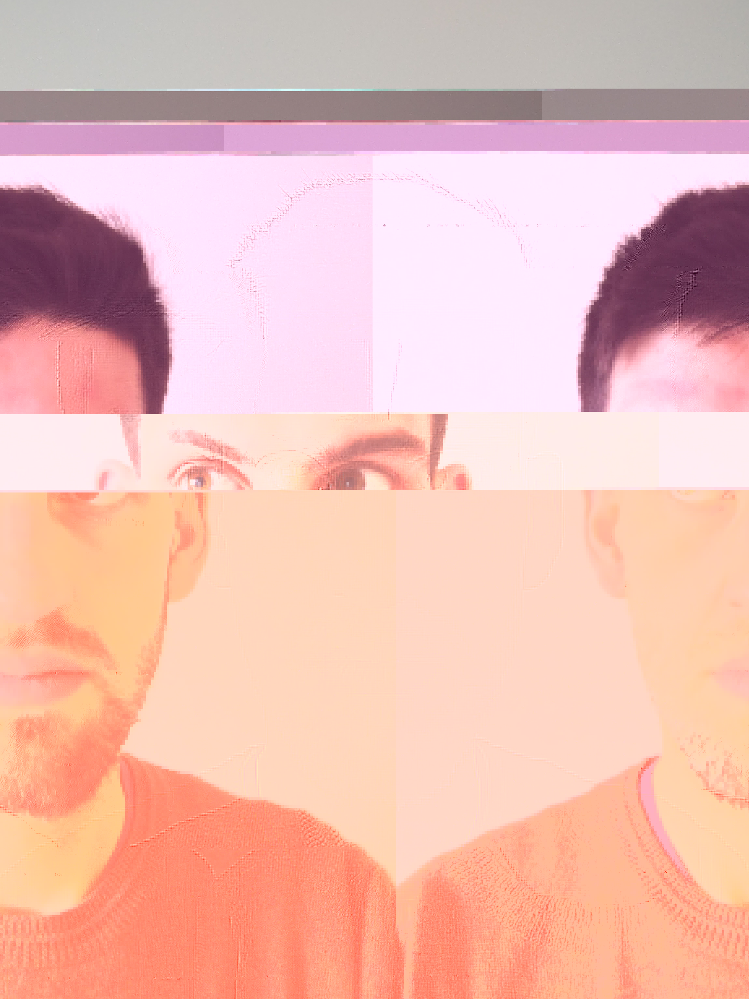

JPEG Manifesto
==============

Pastes UTF-8-encoded lines of the GNU Manifesto into JPEG images to purify them.

By default, generates 100 results in a temporary directory, allowing you to select the most resplendent.

Originally inspired by an article about some Nine Inch Nails cover art that I read in about 2006.

Portrait of the Author
----------------------

